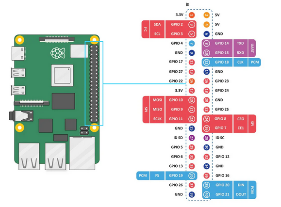

# 📡 EDGE

Repositório para o módulo EDGE, responsável pela captura de vídeo, processamento de inferência ML, armazenamento em buffer e streaming de dados para a nuvem.

## 🖥️ Dispositivo: Raspberry Pi 5

**Especificações:**
- Processador ARM64 otimizado para visão computacional
- Suporte nativo para câmeras Picamera2
- Capacidade de executar modelos YOLO otimizados

---

## 📦 Arquitetura do Projeto

```
edge/
├── video_buffer/          # 🎥 Gerenciamento de captura e buffer de vídeo
│   ├── capture_writer.py  # Captura frames da câmera
│   ├── uploader.py        # Streaming de frames com retry exponencial
│   ├── buffer_manager.py  # Gerencia limite de armazenamento
│   └── storage_policy.py  # Políticas de armazenamento
├── data_aggregator/       # 📊 Agregação de dados e métricas
│   ├── aggregator.py      # Processa detecções
│   ├── subscriber.py      # Consumidor MQTT
│   └── metrics_calculator.py
├── inference/             # 🤖 Inferência com modelos ML
│   ├── model_manager.py   # Carrega e gerencia modelos YOLO
│   └── model_fetcher.py   # Atualização remota de modelos
├── shared/                # 🔧 Módulos compartilhados
│   ├── event_bus.py       # Event bus para comunicação
│   ├── healthcheck.py     # Monitoramento de saúde
│   └── logger.py          # Logging estruturado
├── main.py                # 🚀 Orquestrador principal
├── config.py              # ⚙️ Configurações
└── docker-compose.yml     # 📦 Stack de monitoramento
```

---

## Protocolos de Integração

| Origem                 | Destino | Protocolo | Detalhes             |
| ---------------------- | ------- | --------- | -------------------- |
| MCU (Microcontrolador) | EDGE    | MQTT      | _/embrapac/mcu-data_ |
| EDGE                   | Nuvem   | MQTT      | /embrapac/monitoring |

## Teste rápido UART no GPIO15 (RXD)

Para validar recepção serial no header GPIO do Raspberry Pi 5 (GPIO15 = RXD), use:

```bash
python examples/uart_rx_test.py --port /dev/serial0 --baud 115200
```

Se o payload estiver em JSON, o script mostra a linha bruta e o objeto parseado.
Para ver somente texto cru da serial:

```bash
python examples/uart_rx_test.py --port /dev/serial0 --baud 115200 --raw-only
```


## 🔧 Dependências e Setup

### Apps e Serviços

| Serviço          | Descrição                                       |
| ---------------- | ----------------------------------------------- |
| **Servidor VNC** | Acesso remoto desktop nativo do Raspberry Pi OS |
| **Python 3.10+** | Runtime para aplicação                          |
| **MediaMTX**     | RTSP streaming (opcional)                       |

[def]: #servidor-vnc

### 📚 Bibliotecas Python Principais

**Sistema operacional:**

`libcap-dev` necessário durante instalação das dependências via `pip install` (`picamera2==0.3.34`)

```bash
sudo apt install -y python3-picamera2 libcap-dev
```

**Aplicação principal:**
```bash
pip install ultralytics ncnn opencv-python httpx influxdb-client paho-mqtt
```

| Biblioteca | Propósito |
|-----------|----------|
| **ultralytics** | YOLO para detecção de objetos |
| **ncnn** | Otimização de modelos para ARM64 |
| **opencv-python** | Processamento de imagens |
| **httpx** | Cliente HTTP assíncrono |
| **paho-mqtt** | Comunicação MQTT |

## Streaming de vídeo

O módulo EDGE pode enviar frames capturados da câmera para um serviço HTTP dedicado. Esse fluxo permite separar a captura e inferência local da visualização remota do vídeo mais recente ou de um stream contínuo em MJPEG.

### Fluxo de funcionamento

1. O EDGE captura os frames e gera imagens JPEG.
2. O uploader envia cada frame por `POST` binário para `/stream/upload`.
3. O serviço receptor mantém o último frame recebido e expõe endpoints para inspeção e visualização contínua.

Para maiores detalhes verifique [stream_receiver_service/README.md](stream_receiver_service/README.md).
   

### Configuração de Comunicação Serial no Raspberry Pi 5

| Parâmetro | Valor                   |
| --------- | ----------------------- |
| Device    | `/dev/ttyAMA0`          |
| Baud rate | `115200`                |
| Formato   | `8N1`                   |
| TX        | GPIO14 — pino físico 8  |
| RX        | GPIO15 — pino físico 10 |

O Raspberry Pi 5 exige configuração adicional para habilitar a UART nos pinos GPIO14 (TX, pino 8) e GPIO15 (RX, pino 10).



Os passos abaixo são necessários:

#### 1. Habilitar o UART0 via Device Tree Overlay

Edite o arquivo `/boot/firmware/config.txt` e adicione uma seção `[pi5]` com o overlay correto. O parâmetro genérico `dtparam=uart0=on` **não funciona** no Pi 5 e deve ser evitado.

```ini
[pi5]
dtoverlay=uart0-pi5
```

#### 2. Verificar o `cmdline.txt`

Certifique-se de que **não existe** a entrada `console=serial0,115200` no arquivo `/boot/firmware/cmdline.txt`. Se existir, remova-a para que o sistema operacional não ocupe o dispositivo serial como console de debug.

#### 3. Reiniciar e verificar o device

Após salvar e reiniciar, confirme que o dispositivo foi criado:

```bash
ls -l /dev/ttyAMA*
# Esperado: /dev/ttyAMA0 (GPIO14/15) e /dev/ttyAMA10 (header de debug interno)
```

#### 4. Permissão de acesso

Adicione seu usuário ao grupo `dialout` para acessar o dispositivo sem `sudo`:

```bash
sudo usermod -a -G dialout $USER
```

É necessário fazer logout e login novamente para que a permissão tenha efeito.

#### 5. Teste de loopback (opcional)

Para validar o UART antes de conectar qualquer hardware externo, coloque um jumper entre GPIO14 e GPIO15 e execute:

```bash
# Terminal 1 — receptor
python3 uart_reader.py --port /dev/ttyAMA0 --baud 115200

# Terminal 2 — transmissor
python3 -c "import serial; s=serial.Serial('/dev/ttyAMA0',115200); s.write(b'teste\r\n'); s.close()"
```

Se a palavra `teste` aparecer no Terminal 1, a UART está funcionando corretamente. Remova o jumper antes de conectar o dispositivo externo.


### Detecção de imagens com YOLO: procedimento manual

1) Instalar as bibliotecas necessárias

`pip install ultralytics ncnn`

2) Testando com um modelo genérico (off-the-shelf model)

`yolo detect predict model=yolo11n.pt`

Uma pasta yolo será criada com um arquivo `.pt`

3) Converter formato `pytorch` para `ncnn` que é otimizado para CPUs ARM

`yolo export model=yolo11n.pt format=ncnn`

Uma pasta yolo11n_ncnn_model será criada após a conversão, e será utilizada para rodar a inferência

4) Utilizando um script padrão para obter dados da imagem

`wget https://ejtech.io/code/yolo_detect.py`

Código desse repo: https://github.com/EdjeElectronics/Train-and-Deploy-YOLO-Models/tree/main

Para rodar o script que vai captar o stream da câmera:

`python yolo_detect.py --model=yolo11n_ncnn_model --source=usb/picamera[0-1] --resolution=1280x720`

### Realizando streaming da câmera e salvando num arquivo local

O streaming pode ser obtido através do VLC, mas é necessário que o Raspbian tenha o MediaMTX instalado

1) Instalando MediaMTX

TBD


### Detecção de imagens com YOLO: procedimento via Python script

1) Instalar as bibliotecas necessárias

`pip install ultralytics ncnn opencv-python`

2) Convertendo o modelo treinado para o formato ncnn

`yolo export model=box-sizing.pt format=ncnn`

3) Utilizando script de streming da câmera e OpenCV para exibir o vídeo

`python yolo_detect.py --model=box-sizing_ncnn_model --source=picamera1 --resolution=1280x720`


### Formato do dado de detecção

```json
[
  {
    "timestamp": 1774661151.4267824,
    "class": "Pequena",
    "confidence": 0.7965003848075867,
    //"bbox": [x_min, y_min, x_max, y_max]
    "bbox": [161.16259765625, 219.4057159423828, 270.75555419921875, 303.01177978515625]
  }
]
```

### Formato do dado de saída para métricas

```json
{
  "timestamp": 1774661151.4267824,
  "p_count": 1,
  "m_count": 0,
  "g_count": 0,
  "average_size": "Média"
}
```
